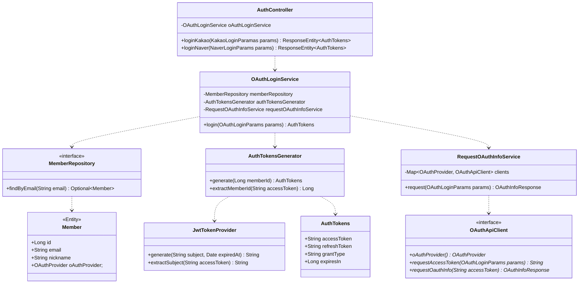
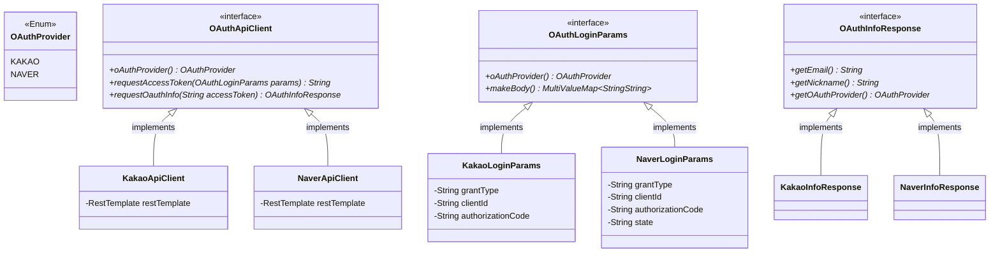

# 전체적인 흐름을 Class Diagram 으로 표현

```mermaid
classDiagram
  class Member {
    <<Entity>>
    +Long id
    +String email
    +String nickname
    +OAuthProvider oAuthProvider;
  }
  class MemberRepository {
    <<interface>>
    +findByEmail(String email) Optional~Member~
  }
  MemberRepository ..> Member

  class JwtTokenProvider {
    +generate(String subject, Date expiredAt) String
    +extractSubject(String accessToken) String
  }

  class AuthTokens {
    +String accessToken
    +String refreshToken
    +String grantType
    +Long expiresIn
  }
  class AuthTokensGenerator {
    +generate(Long memberId) AuthTokens
    +extractMemberId(String accessToken) Long
  }
  AuthTokensGenerator ..> JwtTokenProvider
  AuthTokensGenerator ..> AuthTokens

  class OAuthApiClient {
    <<interface>>
    +oAuthProvider()* OAuthProvider
    +requestAccessToken(OAuthLoginParams params)* String
    +requestOauthInfo(String accessToken)* OAuthInfoResponse
  }
  class RequestOAuthInfoService {
    -Map~OAuthProvider, OAuthApiClient~ clients
    +request(OAuthLoginParams params) OAuthInfoResponse
  }
  RequestOAuthInfoService ..> OAuthApiClient

  class OAuthLoginService {
    -MemberRepository memberRepository
    -AuthTokensGenerator authTokensGenerator
    -RequestOAuthInfoService requestOAuthInfoService
    +login(OAuthLoginParams params) AuthTokens
  }
  OAuthLoginService ..> MemberRepository
  OAuthLoginService ..> AuthTokensGenerator
  OAuthLoginService ..> RequestOAuthInfoService

  class AuthController {
    -OAuthLoginService oAuthLoginService
    +loginKakao(KakaoLoginParamas params) ResponseEntity~AuthTokens~
    +loginNaver(NaverLoginParams params) ResponseEntity~AuthTokens~
  }
  AuthController ..> OAuthLoginService
```

 

# OAuth 도메인 Class Diagram

```mermaid
classDiagram
  class OAuthProvider {
    <<Enum>>
    KAKAO
    NAVER
  }

  class OAuthApiClient {
    <<interface>>
    +oAuthProvider()* OAuthProvider
    +requestAccessToken(OAuthLoginParams params)* String
    +requestOauthInfo(String accessToken)* OAuthInfoResponse
  }
  class KakaoApiClient {
    -RestTemplate restTemplate
  }
  class NaverApiClient {
    -RestTemplate restTemplate
  }
  OAuthApiClient <|-- KakaoApiClient : implements
  OAuthApiClient <|-- NaverApiClient : implements
  
  class OAuthLoginParams {
    <<interface>>
    +oAuthProvider()* OAuthProvider
    +makeBody()* MultiValueMap~StringString~
  }
  class KakaoLoginParams {
    -String grantType
    -String clientId
    -String authorizationCode
  }
  class NaverLoginParams {
    -String grantType
    -String clientId
    -String authorizationCode
    -String state
  }
  OAuthLoginParams <|-- KakaoLoginParams : implements
  OAuthLoginParams <|-- NaverLoginParams : implements

  class OAuthInfoResponse {
    <<interface>>
    +getEmail()* String
    +getNickname()* String
    +getOAuthProvider()* OAuthProvider
  }
  class KakaoInfoResponse {
  }
  class NaverInfoResponse {
  }
  OAuthInfoResponse <|-- KakaoInfoResponse : implements
  OAuthInfoResponse <|-- NaverInfoResponse : implements
```
